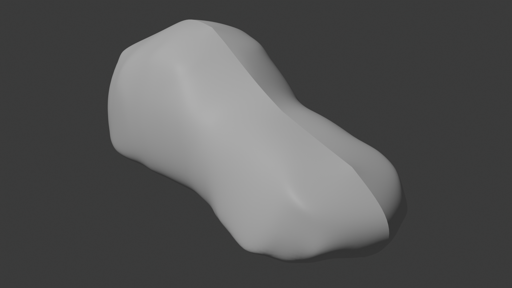

# Body & Chassis

3D-printed body and chassis design for the Team 78 Evolocity 2026 go kart.

**Sponsored by [Marvle3d](https://marvle3d.com)** — providing the 3D printing filament to bring this body to life.

Designed in **FreeCAD** and **Blender**. The body is printed on FDM printers using filament supplied by Marvle3d.

## Files

- `Body.FCStd` — FreeCAD source
- `Body.step` — STEP export for manufacturing
- `Body.stl` — STL mesh for 3D printing
- `Body.blend` — Blender project file
- `Body-Body.gltf` / `Body-Body.bin` — Web-ready GLTF export

## Renders

